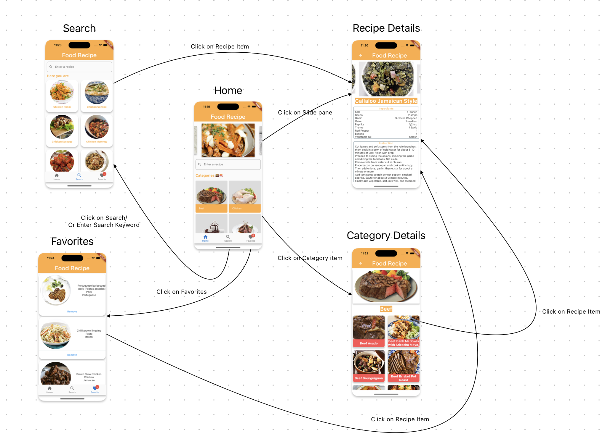

# Find Recipe

A Flutter Sample Base on Riverpod 2.x

## 1. Introduction
* This is a sample applied the template public at [RiverPod Template](https://github.com/monstar-lab-oss/flutter-template-riverpod)
* The main function of the application will be as following
  * Show the available recipes on Screens which the data fetch from RecipeAPI www.themealdb.com
  * Allow user to search by inputing recipe name or related keyword
  * Allow user to browse all available recipes of a certain category
  * Allow user to read the detail of a recipe
  * Allow user to mark a recipe to favorites list or remove from favorite list
## 2. Screen Design and Screen Transition
* **Screens**
  | No | Screen Name | Description|
  |----|-------------|------------|
  |1   | Home        | The Home screen includes a slide pannel which will randomly pick up one of 12 available categories each time the app restarts. <br> The available categories will be show on Home screen.|
  | 2 | Search | The Search screen where the search result will be displayed and the search operation could be also run.|
  | 3 | Favorites| The Favorites Screen will show all favorite recipes|
  | 4 | Recipe Details| The details of a recipe will be show here. 
  | 5 | Category Details| All the recipes related to a category could be found in this screen. 

* **Screen Transition**


## 3. Application Architecture
* The application structured base the Riverpod Template and Guideline.
- [Flutter Riverpod Architecture](https://codewithandrea.com/articles/flutter-app-architecture-riverpod-introduction/)
  - Presentation, Application, Domain and Data Layers.
- Freezed Code Generation
- Riverpod Provider Generation
- Retrofit API calls, `toJson` function Generation.

For help getting started with Flutter development, view the
[online documentation](https://docs.flutter.dev/), which offers tutorials, samples, guidance on
mobile development, and a full API reference.

## Local database - Drift package (formerly named moor)
 [refer to document](https://drift.simonbinder.eu/docs/getting-started/)
The package build on top of sqlite, providing advantages almost same with Room on Android.
We can borrow the concept from android to implement the database structure like DAOs
## How to build
- run below command
```
flutter pub get
flutter packages pub run build_runner build --delete-conflicting-outputs
```

## Run 
### Android Studio
Launch Configurations are included in the `.run` folder. 

### Run iOS/Android using Visual Studio


### run iOS/Android From terminal

```
- flutter run --flavor Development -t lib/main/main_development.dart
```

### run iOS using xcode


## Sample Tests

### How to Run

`flutter test`

### Sample Unit Tests


#### "If Response Data is Null, model list should be empty"


#### "If Response Data is not null, model list should not be empty"


### Sample UI Tests


#### Should display 2 Top Anime Widgets


## Localization
- ref https://docs.flutter.dev/development/accessibility-and-localization/internationalization
- define localization string file in app_en.arb, app_ja.arb it will be automatically generated to use.
- use example - AppLocalizations.of(context)!.home_tab_profile